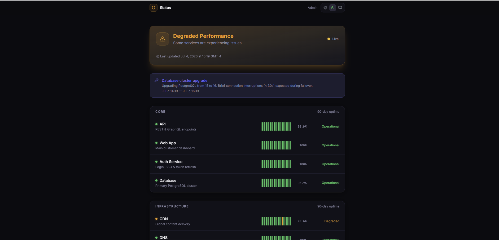
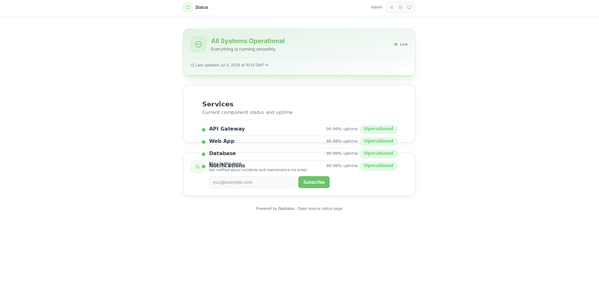
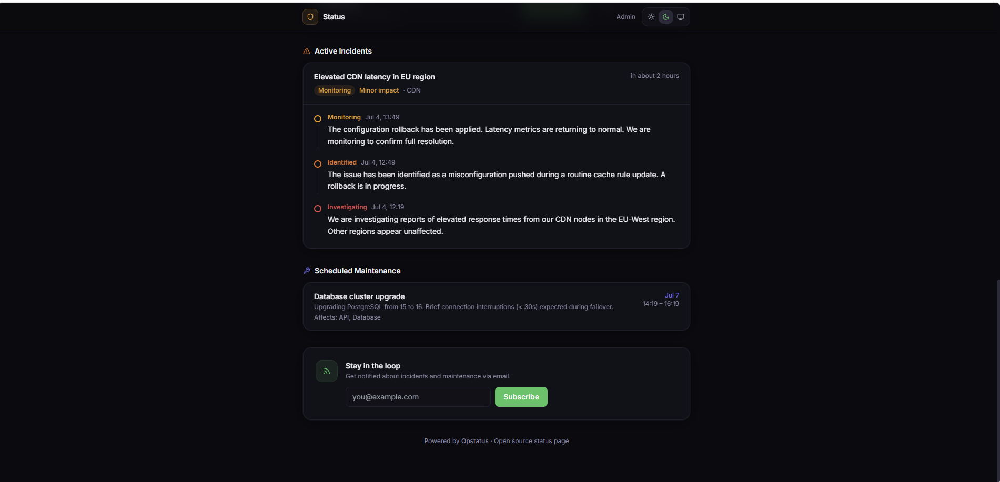

# Opstatus

A beautiful, self-hosted open source status page. Track services, communicate incidents, schedule maintenance, and keep your users subscribed — all from a single SQLite file. No external database. No native compilation. Works on Windows, Mac, and Linux.


---

## Screenshots

### Dark Mode


### Light Mode


### Incident Timeline


---

## Features

- **Service health tracking** — operational / degraded / partial outage / major outage / maintenance
- **90-day uptime bars** — visual history per service, grouped by category
- **Incident management** — create incidents, post timestamped updates (investigating → identified → monitoring → resolved)
- **Maintenance windows** — schedule, track, and complete planned maintenance
- **Email subscribers** — visitors subscribe to status updates; confirm / unsubscribe via token
- **Dark + light mode** — gorgeous on both, three-way toggle (light / dark / system)
- **Zero native dependencies** — uses Node's built-in `node:sqlite` — no node-gyp, no build tools needed
- **Admin panel** — full CRUD via `/admin`, protected by session-based auth
- **Docker ready** — multi-stage Dockerfile + `docker-compose.yml` included

---

## Requirements

- **Node.js 22+** — Opstatus uses Node's built-in `node:sqlite` module (introduced in Node 22). Node 20 will not work.

Check your version:
```bash
node --version   # must be v22.x or higher
```

Download Node 22 from [nodejs.org](https://nodejs.org) if needed.

---

## Quick Start

```bash
# 1. Clone
git clone https://github.com/your-org/opstatus
cd opstatus

# 2. Install dependencies
npm install

# 3. Configure
cp .env.example .env.local
# Edit .env.local — at minimum change ADMIN_PASSWORD and SESSION_SECRET

# 4. Run
npm run dev
```

Open [http://localhost:3000](http://localhost:3000) — public status page.  
Open [http://localhost:3000/admin](http://localhost:3000/admin) — admin panel.

Default admin password: `password` — **change this before going live**.

> **Windows users:** Clone or copy the project to a short path like `C:\opstatus` to avoid Windows' 260-character MAX_PATH limit during `npm install`.

---

## Load Demo Data

After running the dev server at least once (to initialise the database), populate it with realistic demo data:

```bash
# Run from inside the opstatus project folder
node --experimental-sqlite scripts/seed.mjs
```

This seeds:
- 10 services across 3 groups (Core, Infrastructure, Integrations)
- 90 days of uptime history per service (with realistic blips)
- 1 active incident with a 3-step timeline
- 1 scheduled maintenance window

Then restart the dev server and refresh your browser to see everything.

---

## Docker

```bash
# Using Docker Compose (recommended)
cp .env.example .env
# Edit .env with your values

docker compose up -d
```

Or with plain Docker:
```bash
docker build -t opstatus .
docker run -p 3000:3000 \
  -v opstatus_data:/app/data \
  -e ADMIN_PASSWORD=your-secure-password \
  -e SESSION_SECRET=your-32-char-random-secret \
  opstatus
```

---

## Configuration

All config lives in `.env.local` (development) or environment variables (production/Docker).

| Variable | Description | Default |
|---|---|---|
| `NEXT_PUBLIC_SITE_NAME` | Site name in header + tab title | `My Status Page` |
| `NEXT_PUBLIC_SITE_URL` | Public URL of your status page | `http://localhost:3000` |
| `NEXT_PUBLIC_SUPPORT_URL` | Link to your support page (optional) | — |
| `ADMIN_PASSWORD` | Admin panel password | `password` |
| `SESSION_SECRET` | 32+ char random string for session encryption | ⚠️ required in prod |
| `DATABASE_PATH` | Path to SQLite DB file | `./data/opstatus.db` |
| `SMTP_HOST` | SMTP server for email notifications | — |
| `SMTP_PORT` | SMTP port | `587` |
| `SMTP_USER` | SMTP username | — |
| `SMTP_PASS` | SMTP password | — |
| `SMTP_FROM` | From address for emails | — |

---

## Deployment

Opstatus runs anywhere Node.js 22+ runs.

**VPS (Recommended for production):**
```bash
# Install Node 22
curl -fsSL https://deb.nodesource.com/setup_22.x | sudo -E bash -
sudo apt install nodejs

# Clone and build
git clone https://github.com/your-org/opstatus /opt/opstatus
cd /opt/opstatus
npm install && npm run build

# Run with PM2
npm install -g pm2
pm2 start npm --name opstatus -- start
pm2 save && pm2 startup

# Nginx reverse proxy
# server { listen 80; location / { proxy_pass http://localhost:3000; } }
```

**Railway / Render:**  
Deploy directly from GitHub. Set environment variables in the dashboard. Mount a persistent volume at `/app/data` for the SQLite file.

**Vercel:**  
Not recommended — serverless functions don't persist the SQLite file between invocations. Use a VPS or Railway instead.

---

## Admin Panel

Navigate to `/admin` — you'll be redirected to `/login` if not authenticated.

- **Overview** — system status at a glance, stats for services / incidents / maintenance / subscribers
- **Services** — add/edit/delete services, one-click status changes, drag to reorder
- **Incidents** — create incidents, post timestamped updates, track through to resolution
- **Maintenance** — schedule and manage maintenance windows
- **Subscribers** — view confirmed and pending email subscribers

---

## API

All endpoints return JSON. Admin endpoints require an active session cookie (set via `POST /api/auth`).

| Method | Endpoint | Auth | Description |
|---|---|---|---|
| `GET` | `/api/services` | Public | List all services |
| `POST` | `/api/services` | Admin | Create service |
| `PATCH` | `/api/services/:id` | Admin | Update service |
| `DELETE` | `/api/services/:id` | Admin | Delete service |
| `GET` | `/api/incidents` | Public | List incidents |
| `POST` | `/api/incidents` | Admin | Create incident |
| `POST` | `/api/incidents/:id/updates` | Admin | Add incident update |
| `DELETE` | `/api/incidents/:id` | Admin | Delete incident |
| `GET` | `/api/maintenance` | Public | List maintenance |
| `POST` | `/api/maintenance` | Admin | Schedule maintenance |
| `PATCH` | `/api/maintenance/:id` | Admin | Update maintenance |
| `DELETE` | `/api/maintenance/:id` | Admin | Delete maintenance |
| `POST` | `/api/subscribers` | Public | Subscribe to updates |
| `DELETE` | `/api/subscribers?token=` | Public | Unsubscribe |
| `POST` | `/api/auth` | — | Log in (returns session cookie) |
| `DELETE` | `/api/auth` | — | Log out |

---

## Tech Stack

- **[Next.js 14](https://nextjs.org)** — App Router, server components, ISR
- **[node:sqlite](https://nodejs.org/api/sqlite.html)** — built-in Node 22 SQLite (zero native compilation)
- **[iron-session](https://github.com/vvo/iron-session)** — encrypted session cookies
- **[Tailwind CSS](https://tailwindcss.com)** — utility-first styling
- **[next-themes](https://github.com/pacocoursey/next-themes)** — dark/light/system theme toggle
- **[bcryptjs](https://github.com/dcodeIO/bcrypt.js)** — password hashing

---

## License

MIT — use it, fork it, ship it.
